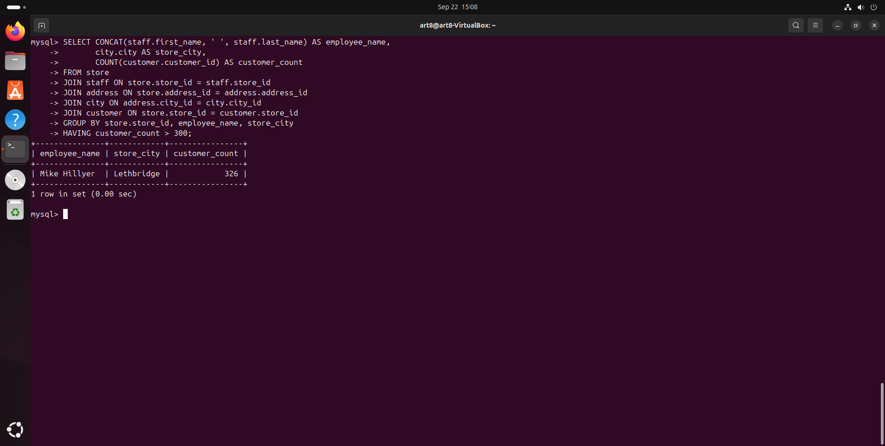
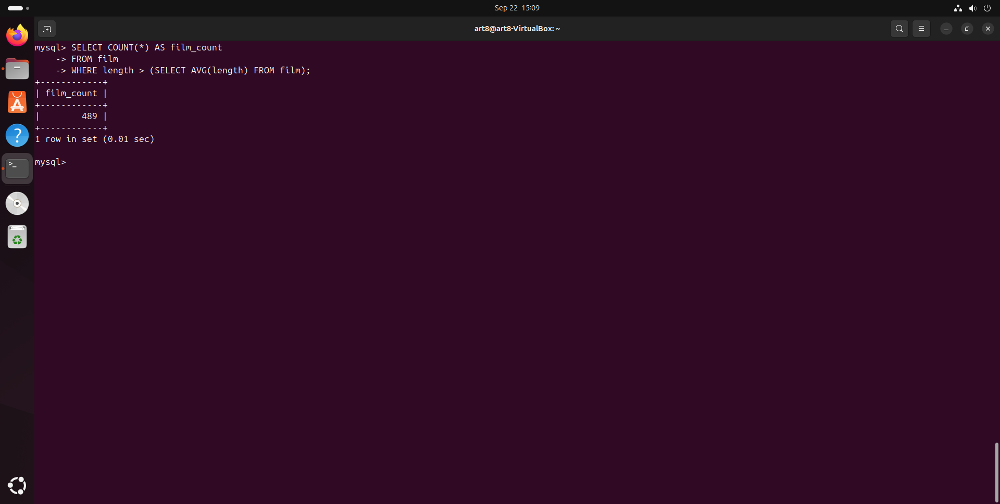
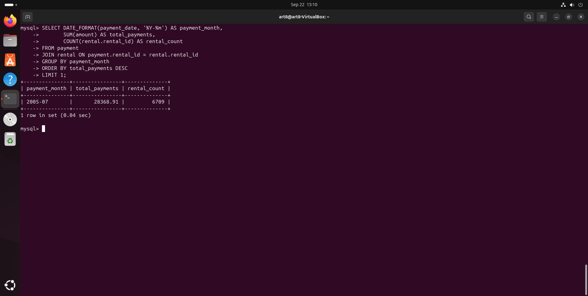

# Домашнее задание по SQL

## Задание 1: Информация о магазине с более чем 300 покупателями
Запрос: 

SELECT CONCAT(staff.first_name, ' ', staff.last_name) AS employee_name,
       city.city AS store_city,
       COUNT(customer.customer_id) AS customer_count
FROM store
JOIN staff ON store.store_id = staff.store_id
JOIN address ON store.address_id = address.address_id
JOIN city ON address.city_id = city.city_id
JOIN customer ON store.store_id = customer.store_id
GROUP BY store.store_id, employee_name, store_city
HAVING customer_count > 300;

## Задание 2: Количество фильмов с продолжительностью больше средней
Запрос: 

SELECT COUNT(*) AS film_count  
FROM film  
WHERE length > (SELECT AVG(length) FROM film);

## Задание 3: Месяц с наибольшей суммой платежей и количеством аренд
Запрос: 

SELECT DATE_FORMAT(payment_date, '%Y-%m') AS payment_month,  
SUM(amount) AS total_payments,  
COUNT(rental.rental_id) AS rental_count  
FROM payment  
JOIN rental ON payment.rental_id = rental.rental_id  
GROUP BY payment_month  
ORDER BY total_payments DESC  
LIMIT 1;

